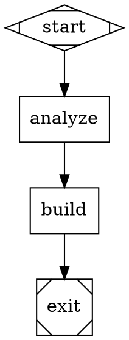
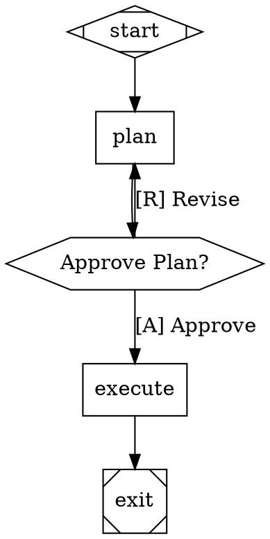
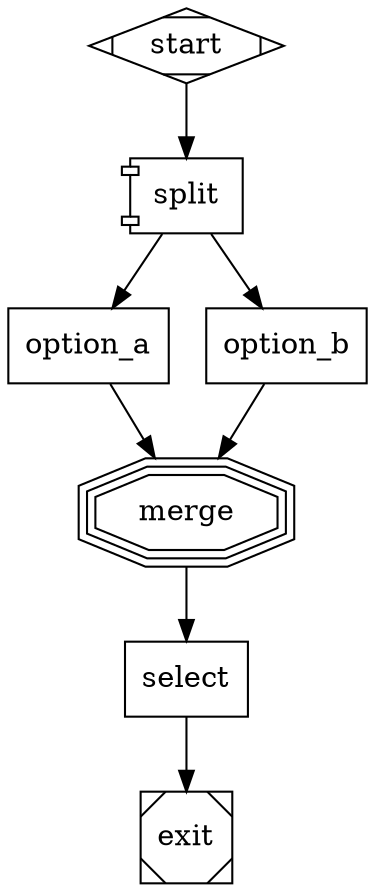

# 🚀 strike v1.1.0 — Quick Reference

## 🎯 I'm here to...

- **Generate unique UIs**: `/ui "prompt"` — Orchestrator with Attractor workflow orchestration
- **Build from specs**: `/build` — Takes enriched spec and creates UI
- **Resume workflows**: `/ui --resume` — Auto-detects and resumes from checkpoint

---

## 🔍 Core Workflow

**POWERED BY ATTRACTOR in v1.1.0 - Enterprise-grade workflow orchestration:**

1. **DOT Workflow** — Define workflows in Graphviz DOT syntax
2. **Event System** — Track everything with 30+ typed events
3. **Checkpoint & Resume** — Crash recovery with state persistence
4. **Human-in-the-Loop** — Approval gates for critical decisions
5. **Parallel Execution** — Concurrent branch processing (2-3x faster)

**Traditional flow (still supported):**
1. **Orchestrator** — Analyzes prompt, detects anti-patterns, selects constraints
2. **Implementer** — Builds validated UI

---

## 🛠️ Quick Commands

| Command | Purpose | When to use |
|---------|---------|-------------|
| `/ui "prompt"` | Full UI generation with Attractor orchestration | New UI projects |
| `/ui --resume` | Resume from checkpoint (auto-detects interruption) | After crash/interruption |
| `/ui --workflow=path.dot "prompt"` | Use custom DOT workflow | Custom workflows |
| `/ui --step "prompt"` | Interactive with human approval gates | Critical projects |
| `/ui --explain "prompt"` | Include diagram explanation | Understand the workflow |
| `/ui --learn "prompt"` | Extract patterns from this session | Improve future results |
| `/build` | Implement from enriched spec | Build the UI |

---

## 📚 Documentation

- **Marketplace**: `.claude-plugin/marketplace.json`
- **Orchestrator**: `plugins/ui/README.md`
- **Implementer**: `plugins/ui/README.md`
- **Attractor Integration**: `plugins/ui/data/attractor/ATTRACTOR-INTEGRATION.md`
- **DOT Grammar**: `plugins/ui/data/attractor/dot-grammar.md`

---

## 🎯 DOT Workflow Examples (NEW v1.1.0)

### Simple Sequential Workflow



### With Human Approval



### Parallel Exploration



---

## 💾 Checkpoint & Resume (NEW v1.1.0)

**Auto-save after each phase:**
```bash
# Checkpoint saved to .claude/.strike/checkpoint.json
{
  "version": "1.1.0",
  "timestamp": "2025-02-10T10:30:00Z",
  "current_node": "build",
  "completed_nodes": ["start", "analyze"],
  "context_values": { "user_prompt": "...", "constraints": [...] }
}
```

**Resume after interruption:**
```bash
# Automatically detects checkpoint and resumes
/ui --resume
```

---

## 📊 Event System (NEW v1.1.0)

**Track everything with 30+ typed events:**
- `SESSION_START` - Session created and initialized
- `PHASE_START` / `PHASE_END` - Phase boundaries
- `ANTI_PATTERNS_DETECTED` - Patterns found to avoid
- `CONSTRAINTS_SELECTED` - Constraints with scores
- `CHECKPOINT_SAVED` / `CHECKPOINT_LOADED` - State persistence
- `HUMAN_APPROVAL_REQUESTED` - Waiting for user input

**Event log:** `.claude/.strike/events.jsonl`

---

## 🛡️ Anti-Patterns Library

The orchestrator has a comprehensive database of patterns to avoid:

### UI Effects
- ❌ Particles canvas
- ❌ Glitch text
- ❌ Scanlines
- ❌ Custom cursor
- ❌ Gradient mesh
- ❌ Blob morphing

### Colors
- ❌ Neon pink-blue
- ❌ Trendy gradients
- ❌ Dark-mode-by-default
- ❌ Pastel everything

### Layouts
- ❌ Generic hero sections
- ❌ Card grids
- ❌ Bento boxes
- ❌ Fullscreen sections
- ❌ Sticky everything

### Interactions
- ❌ Parallax scrolling
- ❌ Scroll reveal
- ❌ Hover effects classic
- ❌ Scroll hijacking
- ❌ Loading animations

### Typography
- ❌ Acid distortion
- ❌ Brutalism helvetica
- ❌ Variable font tricks
- ❌ Giant headlines
- ❌ Gradient text

### Components
- ❌ Glassmorphism cards
- ❌ Neumorphism buttons
- ❌ Floating labels
- ❌ Rounded everything
- ❌ Icon overload

See full database: `plugins/ui/data/core/anti-patterns.json`

---

## 🎭 Constraint Library

The orchestrator selects from creative constraint categories:

### Color Restrictions
- Monochrome true
- Single accent
- Warm only
- Paper & ink
- Inverted high contrast

### Interaction Sources
- Architectural
- Biological
- Musical structure
- Mechanical
- Textual first

### Technical Constraints
- CSS only
- System fonts only
- No images
- Single file
- No animations
- ASCII art only

### Context Shifts
- Print first
- Screen reader first
- Outdoor visible
- Slow connection
- Low energy

### Structural Constraints (NEW)
- Linear only
- No headings
- Infinite scroll
- Component isolation
- Max width extreme

See full library: `plugins/ui/data/core/constraints.json`

---

## 📊 Constraint Scoring (NEW v2.0)

Each constraint is scored (0-100) on:

```
constraintScore = {
  creativity: 0-30,      // How unusual is this?
  difficulty: 0-25,      // How hard to implement?
  impact: 0-25,          // How much does it change the result?
  synergy: 0-20         // How well does it work with other constraints?
}
```

Example scores:
- Paper & ink: 35 (easy, low creativity)
- Architectural: 78 (hard, high creativity)
- ASCII art: 65 (medium, medium creativity)

---

## 📂 Generated Output

When you run `/ui`, it creates in `.claude/.strike/`:

| File | Purpose |
|------|---------|
| `analysis.md` | Prompt analysis with risk assessment |
| `anti-patterns.md` | Detected patterns to avoid |
| `constraints.md` | Selected constraints with scores |
| `enriched-spec.md` | Full specification for implementer |
| `enriched-spec.json` | Validated JSON specification |
| `checkpoint.json` | Latest checkpoint (v1.1.0) |
| `events.jsonl` | Event log (v1.1.0) |
| `step-state.json` | Step mode state (if --step) |

Then `/ui` creates in `./output/`:

| Output | Stack | Purpose |
|--------|-------|---------|
| `./output/react-tailwind/` | React/Tailwind | Component-based production app |
| `./output/vanilla/` | Vanilla | Single-file instant prototype |
| `build-result.json` | Both | Metrics and validation |

**NO README in output/** - Documentation stays in `.claude/.strike/` only.

---

## 🧩 Component Registry (NEW v2.0)

Reference `plugins/ui/data/core/component-registry.json` for validated components.

### Safe Components (All Constraints)
- Container — Responsive container
- Stack — Vertical stack with gap
- Room — Architectural spatial sections
- Heading — Semantic heading
- Body — Body text
- Button — Standard button
- Input — Text input with static label
- Label — Static label (not floating)

### Use With Caution (Has Anti-Pattern Risk)
- Grid → Use Stack or Room instead
- DisplayHeading → Use Heading with size instead
- Card → Use SolidCard or Section instead

---

## ♿ Accessibility (NEW v2.0)

All builds must pass the accessibility checklist:

### Critical Checks
- [ ] Semantic HTML (nav, main, article, section)
- [ ] Keyboard navigation (tab order, focus visible)
- [ ] ARIA attributes (labels, live regions)
- [ ] Color contrast (WCAG AA: 4.5:1 for text)
- [ ] Forms (labels associated, errors announced)

See full checklist: `plugins/ui/data/core/accessibility-checklist.json`

---

## 🎯 Key Principles

- **Anti-trend first**: Generic is the enemy
- **Constraints guide, don't limit**: Find creative solutions within boundaries
- **Accessibility first**: If it's not accessible, it's not done (NEW)
- **Schema-validated communication**: Specs validated before delegation (NEW)
- **Metrics-driven**: Measure compliance, bundle size, a11y scores (NEW)
- **Context matters**: A constraint that works for one project may fail for another
- **Document decisions**: Explain why you made choices, especially constraint violations

---

## 🏗️ Project Standards

### React/Tailwind
```
src/
├── components/
│   ├── ui/           # Atomic components (Button, Input, Card...)
│   ├── layout/        # Layout (Header, Footer, Container...)
│   └── features/      # Feature-specific components
├── hooks/             # Custom React hooks
├── utils/             # Utilities (cn helper, formatDate...)
├── App.tsx            # Root component
└── index.tsx           # Entry point
```

### Vanilla
```
index.html              # Self-contained, all CSS/JS inline
```

---

## 🔧 Configuration

Settings in `.claude/.strike/config.json`:

```json
{
  "orchestrator": {
    "min_constraints": 2,
    "max_constraints": 4,
    "strict_mode": false,
    "always_include": ["color_restrictions"],
    "prefer_categories": ["technical_constraints"],
    "anti_pattern_severity_threshold": "medium",
    "scoring_weights": {
      "creativity": 0.3,
      "difficulty": 0.25,
      "impact": 0.25,
      "synergy": 0.2
    },
    "feedback_learning": true
  }
}
```

---

## 💡 Best Practices

1. **Use `/ui` for new requests** — Always go through orchestrator
2. **Read the enriched spec** — Don't skip constraint analysis
3. **Check component registry** — Use validated components (NEW)
4. **Validate your plan** — Check against anti-pattern blacklist
5. **Plan accessibility from start** — Not an afterthought (NEW)
6. **Choose the right template** — React/Tailwind for apps, Vanilla for demos
7. **Document your choices** — README should explain constraints and decisions
8. **Include build metrics** — build-result.json required (NEW)

---

## 🚫 What Not To Do

- ❌ Don't skip orchestrator for "faster" results — You'll get generic UI
- ❌ Don't ignore constraints — They're not optional guidelines
- ❌ Don't use "trendy" templates from the internet — Orchestrator detects them as anti-patterns
- ❌ Don't assume constraints are "too limiting" — They're liberation, not restriction
- ❌ Don't skip accessibility — It's mandatory in v2.0 (NEW)
- ❌ Don't skip metrics — build-result.json is required (NEW)

---

## 🆕 What's New in v1.1.0

| Feature | Description |
|---------|-------------|
| **DOT Workflow Orchestration** | Define workflows in Graphviz DOT syntax |
| **Event System** | 30+ typed event kinds for complete observability |
| **Checkpoint & Resume** | Crash recovery with state persistence |
| **Human-in-the-Loop** | Approval gates with WaitForHuman nodes |
| **Parallel Execution** | Concurrent branch processing (2-3x faster) |
| **Conditional Routing** | Smart workflow branching with 5-step edge selection |
| **Model Stylesheet** | CSS-like LLM configuration |
| **Context Fidelity** | 6 modes for conversation history management |
| **Steering** | Mid-task message injection for dynamic redirection |
| **Goal Gates** | Critical nodes that must succeed before exit |
| **New Flags** | `--resume`, `--workflow=<path>`, `--step` |

---

**Version**: 1.1.0 | **Last updated**: 2025-02-10 | **Powered by [Attractor](https://github.com/strongdm/attractor)**
