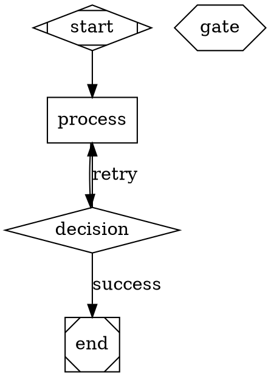

# Contributing to Strike

First off, thank you for considering contributing to Strike! It's people like you that make Strike such a great tool for anti-trend UI generation.

## Table of Contents

- [Code of Conduct](#code-of-conduct)
- [How Can I Contribute?](#how-can-i-contribute)
- [Adding UI Patterns](#adding-ui-patterns)
- [Adding Constraints](#adding-constraints)
- [Creating Workflows](#creating-workflows)
- [Building Plugins](#building-plugins)
- [Development Setup](#development-setup)
- [Pull Request Process](#pull-request-process)
- [Style Guide](#style-guide)

## Code of Conduct

This project and everyone participating in it is governed by our Code of Conduct. By participating, you are expected to uphold this code. Please report unacceptable behavior to [GitHub Issues](https://github.com/Pamacea/strike/issues).

## How Can I Contribute?

### Reporting Bugs

Before creating bug reports, please check existing issues to avoid duplicates. When you create a bug report, include as many details as possible:

**Bug Report Template:**

```markdown
**Description**
A clear and concise description of what the bug is.

**Reproduction Steps**
1. Go to '...'
2. Click on '....'
3. Scroll down to '....'
4. See error

**Expected Behavior**
A clear and concise description of what you expected to happen.

**Screenshots**
If applicable, add screenshots to help explain your problem.

**Environment:**
- OS: [e.g. Windows 11, macOS 14]
- Claude Code Version: [e.g. 2.1.32]
- Strike Version: [e.g. 2.0.0]
```

### Suggesting Enhancements

Enhancement suggestions are tracked as GitHub issues. When creating an enhancement suggestion, include:

- **Use a clear title** - Describe the enhancement
- **Detailed description** - What should be added/changed and why
- **Examples** - How this enhancement would be used

## Adding UI Patterns

UI patterns are reusable design approaches that avoid common trends.

### Pattern Structure

Create a new pattern in `registry/ui-patterns.json`:

```json
{
  "id": "pattern-identifier",
  "name": "Pattern Display Name",
  "description": "Clear description of what this pattern does and when to use it",
  "category": "layout|color|components|approach|technical",
  "tags": ["tag1", "tag2", "tag3"],
  "version": "1.0.0",
  "author": "Your Name",
  "license": "MIT",
  "dependencies": [],
  "metadata": {
    "difficulty": "easy|medium|hard",
    "creativity": 0-30,
    "difficultyScore": 0-25,
    "impact": 0-25,
    "synergy": 0-20,
    "totalScore": 0-100,
    "accessibility": "WCAG-A|WCAG-AA|WCAG-AAA"
  },
  "examples": [
    {
      "title": "Example Title",
      "description": "What this example shows"
    }
  ],
  "compatibility": ["react-tailwind", "vanilla", "nextjs", "remix", "vite"]
}
```

### Pattern Scoring Guidelines

**Creativity (0-30):** How unusual is this pattern?
- 0-10: Common, seen frequently
- 11-20: Uncommon, distinctive
- 21-30: Rare, highly original

**Difficulty (0-25):** How hard to implement?
- 0-8: Easy, straightforward
- 9-16: Medium, requires skill
- 17-25: Hard, complex implementation

**Impact (0-25):** How much does it change the result?
- 0-8: Subtle difference
- 9-16: Noticeable difference
- 17-25: Dramatic difference

**Synergy (0-20):** How well does it work with other constraints?
- 0-6: Difficult to combine
- 7-13: Works well with some
- 14-20: Highly synergistic

### Submit Pattern

1. Add pattern to `registry/ui-patterns.json`
2. Validate with `./plugins/ui/scripts/validate-marketplace.sh`
3. Create PR with title `pattern: Add <pattern-name>`
4. Describe the pattern and its use cases

## Adding Constraints

Constraints are creative limitations that push design in unexpected directions.

### Constraint Structure

Create a new constraint in `registry/constraints.json`:

```json
{
  "id": "constraint-identifier",
  "name": "Constraint Display Name",
  "description": "What this constraint does and how it affects design",
  "category": "color-restrictions|interaction-sources|technical-constraints|context-shifts|structural-constraints",
  "tags": ["tag1", "tag2", "tag3"],
  "version": "1.0.0",
  "author": "Your Name",
  "license": "MIT",
  "dependencies": [],
  "metadata": {
    "difficulty": "easy|medium|hard",
    "creativity": 0-30,
    "difficultyScore": 0-25,
    "impact": 0-25,
    "synergy": 0-20,
    "totalScore": 0-100
  },
  "examples": [
    {
      "title": "Example Title",
      "description": "How this constraint is used"
    }
  ],
  "compatibility": ["react-tailwind", "vanilla", "nextjs", "remix", "vite"]
}
```

### Submit Constraint

1. Add constraint to `registry/constraints.json`
2. Validate with `./plugins/ui/scripts/validate-marketplace.sh`
3. Create PR with title `constraint: Add <constraint-name>`
4. Explain the constraint's inspiration and rationale

## Creating Workflows

Workflows are DOT-based orchestration pipelines for UI generation.

### Workflow Structure

Create a new workflow in `registry/workflows.json`:

```json
{
  "id": "workflow-identifier",
  "name": "Workflow Display Name",
  "description": "What this workflow does and when to use it",
  "category": "simple|interactive|parallel|adaptive|educational",
  "tags": ["tag1", "tag2"],
  "version": "1.0.0",
  "author": "Your Name",
  "license": "MIT",
  "dependencies": [],
  "metadata": {
    "difficulty": "easy|medium|hard",
    "estimatedTime": "5-10 min"
  },
  "dot": "digraph WorkflowName {\n  ...DOT syntax...\n}",
  "examples": [
    {
      "title": "Use Case",
      "description": "When to use this workflow"
    }
  ]
}
```

### DOT Syntax Reference



### Submit Workflow

1. Add workflow to `registry/workflows.json`
2. Validate DOT syntax
3. Test with `/ui --workflow=<workflow-id>`
4. Create PR with title `workflow: Add <workflow-name>`

## Building Plugins

Plugins extend Strike with new functionality.

### Plugin Structure

```
plugins/my-plugin/
├── README.md          # Plugin documentation
├── plugin.json        # Plugin manifest
├── commands/          # Slash commands
├── skills/            # Progressive disclosure skills
├── agents/            # Autonomous agents
└── hooks/             # Event-driven automation
```

### Plugin Manifest

```json
{
  "name": "my-plugin",
  "version": "1.0.0",
  "description": "Brief description",
  "author": {
    "name": "Your Name"
  },
  "license": "MIT",
  "category": "category-name",
  "tags": ["tag1", "tag2"],
  "keywords": ["keyword1", "keyword2"],
  "dependencies": ["core"],
  "skills": [],
  "commands": [],
  "agents": [],
  "hooks": {}
}
```

### Submit Plugin

1. Create plugin structure
2. Implement functionality
3. Test locally with Claude Code
4. Add to marketplace.json
5. Create PR with title `plugin: Add <plugin-name>`

## Development Setup

### Prerequisites

- Node.js 18+
- Claude Code v2.1.32+
- Git

### Setup

```bash
# Clone repository
git clone https://github.com/Pamacea/strike.git
cd strike

# Install dependencies (if any)
npm install

# Validate marketplace
./plugins/ui/scripts/validate-marketplace.sh
```

### Testing

```bash
# Validate marketplace
./plugins/ui/scripts/validate-marketplace.sh

# Test UI generation
/ui "Create a test button"

# Test with workflow
/ui --workflow=quick-sequential "Create a card"
```

## Pull Request Process

### 1. Update Documentation

If your changes affect usage, update the README.

### 2. Commit Messages

Use conventional commit format:

```
type(scope): description

[optional body]

[optional footer]
```

**Types:**
- `pattern` - Adding/modifying UI patterns
- `constraint` - Adding/modifying constraints
- `workflow` - Adding/modifying workflows
- `plugin` - Adding/modifying plugins
- `docs` - Documentation changes
- `fix` - Bug fixes
- `refactor` - Code refactoring

**Examples:**

```
pattern: Add brutalist-grid layout pattern

Implements brutalist grid pattern with visible borders
and raw aesthetics for technical, honest UI design.

Score: 79/100
Creativity: 25/30
Difficulty: 18/25
Impact: 20/25
Synergy: 16/20
```

### 3. PR Template

```markdown
## Description
Brief description of changes

## Type
- [ ] pattern
- [ ] constraint
- [ ] workflow
- [ ] plugin
- [ ] docs
- [ ] fix

## Testing
How was this tested?

## Checklist
- [ ] Code follows style guide
- [ ] Self-review completed
- [ ] Documentation updated
- [ ] No new warnings
- [ ] Tests added/updated
- [ ] All tests passing
```

### 4. Review Process

- Automated validation runs on PR
- Maintainer review (typically within 48 hours)
- Community feedback encouraged
- Changes requested via PR comments

### 5. Merge

- Maintainer merges after approval
- Squash merge to maintain clean history
- Changelog updated automatically

## Style Guide

### JSON

- 2-space indentation
- Double quotes
- Trailing commas in arrays/objects
- No trailing whitespace

### Markdown

- ATX-style headings (`#` vs `##`)
- Bullet lists with `-`
- Code blocks with triple backticks
- Link format: `[text](url)`

### DOT (Workflows)

- 4-space indentation
- Descriptive node/edge names
- Comments for complex logic
- Consistent node shapes

## Questions?

- Open an issue for questions
- Check existing discussions
- Read documentation in `plugins/*/README.md`

---

Thank you for contributing to Strike! 🎉
