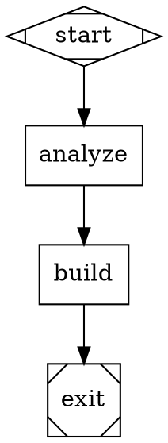
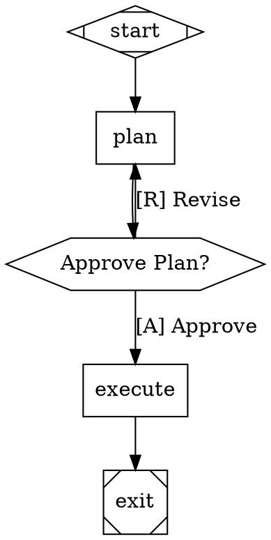
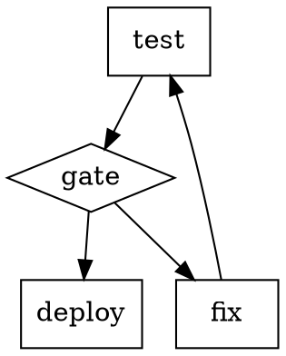
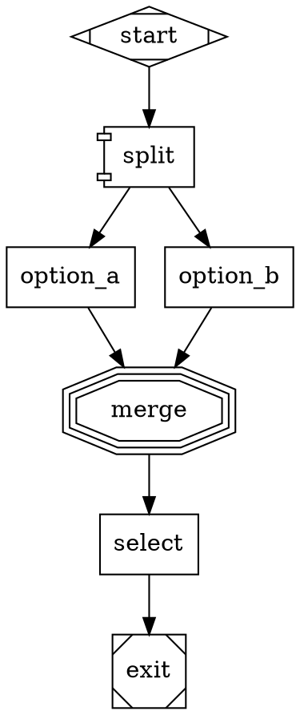

# Strike v1.1.0

[](https://opensource.org/licenses/MIT)
[](https://github.com/Pamacea/strike/releases/latest)
[](https://github.com/Pamacea/strike/actions)
[](https://github.com/strongdm/attractor)

> **Enterprise-grade UI generation with Attractor workflow orchestration, event observability, checkpoint/resume, and DOT graph workflows**

Break patterns. Create unique. Build thoughtful interfaces. Iterate instantly.

---

## What is Strike?

**Strike** is a creative constraint system for Claude Code that prevents generic UI patterns through **Attractor-powered workflow orchestration**. It combines:

1. **Orchestrator** — Analyzes prompts, detects anti-patterns (dynamic + static), applies creative constraints
2. **Implementer** — Builds the UI from enriched specification
3. **Attractor Engine** — DOT-based workflow orchestration with events, checkpoints, and resilience

**New in v1.1.0 - Attractor Edition:**
- 🎯 **DOT Workflow Orchestration** - Define workflows in Graphviz DOT syntax
- 💾 **Checkpoint & Resume** - Crash recovery and state persistence
- 📊 **Event Observability** - 30+ typed events for complete tracking
- 👤 **Human-in-the-Loop** - Approval gates and interactive workflows
- 🚀 **Parallel Execution** - Concurrent branch processing
- 🔀 **Conditional Routing** - Smart workflow branching
- 🎨 **Model Stylesheet** - CSS-like LLM configuration
- 💬 **Steering** - Mid-task dynamic redirection

---

## Why Strike Exists

Modern web design has converged on a narrow set of "safe" choices. Glassmorphism, card grids, neon gradients, parallax scrolling — they're not bad, they're **everywhere**.

**Strike is the guard against the obvious.** It doesn't just build what you ask — it builds what you **should have asked for** if you wanted something unique.

---

## 🚀 Key Features

### Orchestrator (`/ui`)

- **Dynamic anti-pattern detection** — 40+ static + unlimited generated patterns
- **Creative constraint engine** — 25+ constraint types with scoring (creativity, difficulty, impact, synergy)
- **Context-aware selection** — Constraints that fit your project, not random
- **Schema validation** — JSON Schema for specs and build results
- **Adversarial mode** — Challenges its own decisions and proposes alternatives
- **Teaching mode** — Generates diagrams and explanations
- **Auto-learning** — Extracts patterns from successful sessions
- **Teams mode** — Parallel multi-agent execution (2-3x faster)

### Implementer (`/build`)

- **Two stacks** — React/Tailwind (production) or Vanilla (prototype)
- **Anti-pattern validation** — Checks implementation against blacklist
- **Constraint compliance** — Respects all creative boundaries
- **Component registry** — Validated components with alternatives
- **Accessibility-first** — WCAG AA compliance, semantic HTML, keyboard nav
- **Build metrics** — Bundle size, compliance scores, timing

### Attractor Engine (NEW v4.0)

- **DOT workflows** — Declarative graph-based pipelines
- **Event system** — Complete observability with 30+ event types
- **Checkpoints** — Auto-save after each phase, resume on interruption
- **Human gates** — Pause for approval at critical points
- **Parallel execution** — Run multiple branches concurrently
- **Conditional routing** — Smart branching based on outcomes
- **Model stylesheet** — Optimize LLM usage with CSS-like config
- **Context fidelity** — Control conversation history management
- **Steering** — Inject messages mid-execution

---

## Usage

### Basic UI Generation

```bash
# Full workflow with deep analysis
/ui "Create a modern SaaS dashboard"

# Demo mode - lightweight and fast
/ui --demo "Quick portfolio site"

# Teams mode - parallel multi-agent execution (2-3x faster)
export CLAUDE_CODE_EXPERIMENTAL_AGENT_TEAMS="1"
/ui --team "E-commerce platform with billing"

# Build from existing spec
/ui --build
```

### Attractor Mode

```bash
# Resume from checkpoint (auto-detects interruption)
/ui --resume

# Use custom DOT workflow
/ui --workflow=".claude/.strike/my-workflow.dot" "Create landing page"

# With human approval gates
/ui --step "Complex application with reviews"
```

### Analysis Only

```bash
# Just analyze prompt, show patterns
/ui --analyze "Futuristic portfolio"

# Show constraints to be applied
/ui --constraints "Minimalist blog"

# Validate existing spec
/ui --validate
```

---

## Output Structure

### Orchestrator Output (`.claude/.strike/`)

```
.claude/.strike/
├── analysis.md              # Prompt risk assessment
├── anti-patterns.md         # Detected patterns to avoid
├── constraints.md           # Selected constraints with scores
├── enriched-spec.md         # Full brief for implementer
├── enriched-spec.json       # Validated JSON specification
├── checkpoint.json          # Latest checkpoint (v4.0)
├── events.jsonl             # Event log (v4.0)
└── step-state.json          # Step mode state (if --step)
```

### Implementer Output (`./output/`)

```
./output/
├── react-tailwind/          # Production app
│   ├── src/
│   ├── package.json
│   └── ...
└── vanilla/                  # Prototype
    ├── index.html
    └── ...
```

---

## DOT Workflow Examples

### Simple Sequential Workflow



### With Human Approval



### Conditional Routing



### Parallel Exploration



---

## Configuration

### Strike Configuration

`.claude/.strike/config.json`:

```json
{
  "ui": {
    "min_constraints": 2,
    "max_constraints": 4,
    "strict_mode": false,
    "always_include": ["color_restrictions"],
    "prefer_categories": ["technical_constraints"],
    "anti_pattern_severity_threshold": "medium",
    "scoring_weights": {
      "creativity": 0.3,
      "difficulty": 0.25,
      "impact": 0.25,
      "synergy": 0.2
    },
    "feedback_learning": true
  },
  "attractor": {
    "enable_events": true,
    "enable_checkpoints": true,
    "auto_resume": true,
    "max_parallel_branches": 4,
    "checkpoint_interval": "auto",
    "event_log_path": ".claude/.strike/events.jsonl"
  }
}
```

---

## Options

| Flag | Description |
|------|-------------|
| `--step` | Interactive workflow - pause at each phase for review |
| `--build` | Build from existing spec (skip orchestration) |
| `--team` | Teams mode for parallel multi-agent execution |
| `--demo` | Lightweight mode - faster, fewer tokens |
| `--analyze` | Only analyze prompt, don't build |
| `--constraints` | Show constraints to be applied |
| `--full` | Run complete workflow with verbose output |
| `--stack=<react|vanilla>` | Force specific tech stack |
| `--strict` | Reject prompt if too many anti-patterns |
| `--score` | Show constraint scoring details |
| `--validate` | Run schema validation only |
| `--explain` | Generate explanation diagrams |
| `--learn` | Extract patterns from session |
| `--feedback=<id>` | Include previous feedback |
| `--no-challenge` | Skip adversarial challenge |
| `--resume` | Resume from checkpoint (NEW v4.0) |
| `--workflow=<path>` | Use custom DOT workflow (NEW v4.0) |

---

## Documentation

- [CLAUDE.md](CLAUDE.md) — Quick reference for users
- [CHANGELOG.md](CHANGELOG.md) — Version history and changes
- [plugins/ui/data/attractor/ATTRACTOR-INTEGRATION.md](plugins/ui/data/attractor/ATTRACTOR-INTEGRATION.md) — Complete Attractor API guide

---

## Philosophy

**Why anti-patterns?** Modern UI has converged. When everything looks the same, nothing stands out.

**Why constraints?** Limitations breed creativity. When you can't use gradients, you discover typography. When you can't use images, you learn what CSS can do.

**The goal:** Not to be contrarian, but to push past the first obvious solution and find something that actually fits the content, users, and context.

---

## Anti-Patterns Database

| Category | Patterns | Severity |
|----------|----------|----------|
| UI Effects | Particles, glitch, scanlines, custom cursor, gradient mesh, blob morphing | High |
| Colors | Neon pink-blue, trendy gradients, dark-mode default, pastel everything | Medium |
| Layouts | Generic hero, card grids, bento boxes, fullscreen sections, sticky everything | High |
| Interactions | Parallax, scroll reveal, scroll hijack, loading animations | High |
| Typography | Acid distortion, brutalism helvetica, variable font tricks, giant headlines | Medium |
| Components | Glassmorphism, neumorphism, floating labels, rounded everything, icon overload | High |

---

## Constraint Library

| Category | Examples | Difficulty |
|----------|----------|------------|
| Color Restrictions | Monochrome, single accent, warm only, paper & ink, inverted contrast | Easy-Medium |
| Interaction Sources | Architectural, biological, musical, mechanical, textual | Medium-Hard |
| Technical Constraints | CSS only, system fonts only, no images, single file, no animations, ASCII art | Easy-Hard |
| Context Shifts | Print first, screen reader first, outdoor visible, slow connection, low energy | Medium-Hard |
| Structural Constraints | Linear only, no headings, infinite scroll, component isolation, max width extreme | Easy-Hard |

---

## Examples

### Example 1: "Modern analytics dashboard"

**Analysis:**
- "Modern" → High risk (trendy colors, glassmorphism)
- "Dashboard" → High risk (card grids, generic hero)
- "Analytics" → Medium risk (charts, data viz)

**Applied Constraints:**
- Paper & ink (off-white, dark text) — score: 35
- Architectural (room-based navigation) — score: 78
- Print first — score: 72

**Result:** A dashboard that uses white space as architecture, numbers as typography, and feels like a well-designed annual report.

### Example 2: "Sleek portfolio"

**Analysis:**
- "Sleek" → High risk (gradients, dark mode, animations)
- "Portfolio" → Medium risk (parallax, gallery grid)

**Applied Constraints:**
- ASCII art only — score: 65
- System fonts only — score: 22
- Single file — score: 18

**Result:** A portfolio that looks like a beautifully formatted README, loads instantly, and showcases code thinking.

---

## Installation

Via Claude Code marketplace:

```bash
# In Claude Code, open marketplace
# Search for "strike"
# Click install
```

Manual installation:

```bash
git clone https://github.com/Pamacea/strike ~/.claude/plugins/strike
```

---

## License

MIT — See [LICENSE](LICENSE) for details.

---

*Version*: 4.0.0 | *Author*: Pamacea | *Repository*: https://github.com/Pamacea/strike

**Powered by [Attractor](https://github.com/strongdm/attractor) - DOT-based workflow orchestration for AI pipelines**
