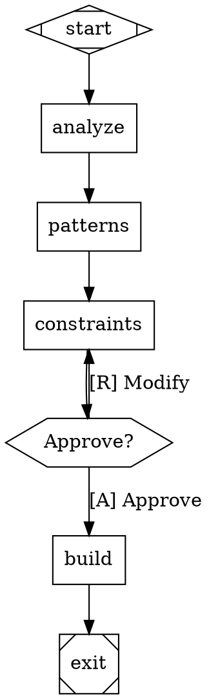

# UI Orchestrator Skill v4.1 - Attractor Edition

## Mission

Transform generic UI prompts into unique, anti-trend specifications using **enterprise-grade Attractor workflow orchestration**. Detect overused patterns with 100 forbidden anti-patterns, generate prompt-specific anti-patterns dynamically, impose creative constraints with scoring, and execute with full observability, checkpoint resilience, and human-in-the-loop control.

---

## ⚙️ Active Baseline Configuration

**Default Dials (adapt based on flags/context):**

| Dial | Default | Range | Purpose |
|------|---------|-------|---------|
| `ANTI_TREND_STRENGTH` | 7 | 1-10 | 1=Safe/Conventional, 10=Radical/Experimental |
| `CREATIVITY_TARGET` | 8 | 1-10 | 1=Follow trends, 10=Break all patterns |
| `CONSTRAINT_DIFFICULTY` | 6 | 1-10 | 1=Easy/Common, 10=Hard/Challenging |
| `ACCESSIBILITY_PRIORITY` | 9 | 1-10 | 1=Nice-to-have, 10=Mandatory/WCAG AA+ |

**AI Instruction:**
- Adapt these values based on explicit flags (`--demo` → lower creativity, `--full` → max strength)
- Task complexity (simple page → strength 5, system → strength 9)
- User expertise (`--step` mode → strength 7 for learning)
- Production context (`--team` → strength 8 for enterprise)

**Justification:**
- Strength 7: Balanced (not too safe, not too experimental)
- Creativity 8: Push boundaries while remaining usable
- Difficulty 6: Challenging but achievable
- A11y 9: Accessibility is non-negotiable (design-taste-frontend principle)

---

## 🎯 Core Workflow

```
UI ORCHESTRATOR v4.1 WORKFLOW
┌─────────────────────────────────────────────────────────────────┐
│                                                                 │
│  1. RECEIVE          Raw prompt from user                       │
│       ↓              "Un site futuriste, nuageux et mélancolique"│
│                                                                 │
│  2. ANALYZE          Scan for trend-trap keywords               │
│       ↓              → "futuriste" detected (semantic)          │
│                      → "nuageux" detected (semantic)            │
│                      → "mélancolique" detected (semantic)       │
│                                                                 │
│  3. GENERATE         Create NEW anti-patterns from keywords    │
│       ↓              → Semantic reasoning from keywords         │
│                      → Combine existing patterns                │
│                      → EXPLICITLY SHOW to user                  │
│                                                                 │
│  4. DETECT           Load anti-patterns.json (static DB)        │
│       ↓              → Match prompt to pattern categories       │
│                      → Add static patterns to list              │
│                                                                 │
│  5. SELECT           Load constraints.json                       │
│       ↓              → Choose 2-4 creative constraints          │
│                      → Score constraints                        │
│                      → Resolve conflicts                        │
│                                                                 │
│  6. VALIDATE         Validate spec against schema               │
│       ↓              → JSON Schema validation                   │
│                                                                 │
│  7. BUILD            Execute build (or delegate to build agent)  │
│       ↓              → React/Tailwind or Vanilla                 │
│                      → Anti-pattern validation                   │
│                                                                 │
│  8. EXPLAIN (opt)    Diagram explanations                       │
│       ↓              → Visual workflow diagrams                 │
│                                                                 │
│  9. LEARN (opt)      Extract patterns                           │
│                      → Document successful combos               │
└─────────────────────────────────────────────────────────────────┘
```

---

## 🚫 The 100 UI Anti-Patterns (Forbidden Patterns)

**Visual & CSS (15)**
- NO Neon/Outer Glows, Pure Black, Oversaturated Accents
- NO Excessive Gradient Text, Custom Mouse Cursors
- NO Gradient Mesh, Glassmorphism Overuse, Blob Morphing
- NO Scanlines, Glitch Text, Particle Canvas
- NO Chrome Reflections, Drop Shadows Everywhere

**Typography (10)**
- NO Inter Font, Oversized H1s, Serif Fonts on Dashboards
- NO Variable Font Tricks, Acid Distortion
- NO Brutalist Helvetica, Mixed Font Families
- NO Tight Letter Spacing, All Caps Body Text
- NO Font Size Under 14px

**Layout & Spacing (15)**
- NO Generic Hero Sections, 3-Column Card Layouts
- NO Bento Box Overuse, Fullscreen Sections, Sticky Everything
- NO Card Grids, Centered Content Only, Infinite White Space
- NO Equal Padding, Horizontal Symmetry, 12-Column Grid Always

**Content & Data (20)**
- NO Generic Names ("John Doe"), Fake Perfect Data
- NO Startup Slop Names ("Acme", "Nexus")
- NO Filler Words ("Elevate", "Seamless")
- NO Lorem Ipsum, Stock Photo Models, Fake avatars
- NO "Coming Soon", "Sign Up" without context
- NO "World's Leading", "Revolutionary" without proof

**Components (20)**
- NO Glassmorphism Cards, Neumorphism Buttons
- NO Floating Labels, Rounded Everything
- NO Default shadcn/ui without customization
- NO Modals Without Escape, Loading Spinners Everywhere
- NO Toggle Switches for Everything, Dropdowns for 2-3 Options

**Interactions (10)**
- NO Parallax Scrolling, Scroll Reveal, Scroll Hijacking
- NO Hover Effects Only, Loading Screens Without Progress
- NO Auto-Playing Videos, Mouse-Following Effects

**External Resources (10)**
- NO Broken Unsplash Links, Generic Stock Photos
- NO Placeholder Images Without Alt Text
- NO External Font Loading Without Fallback
- NO Large External Scripts, Icons from Multiple Libraries
- NO Emoji in Code/Markup

**See `references/anti-patterns-guide.md` for complete list with fixes.**

---

## 🎛️ Technical Reference: Dial Definitions

### ANTI_TREND_STRENGTH (Level 1-10)
- **1-3 (Conservative):** Minor tweaks to trends, safe choices
- **4-7 (Balanced):** Clear departure from trends, unique but usable
- **8-10 (Experimental):** Radical rethinking, challenging conventions

### CREATIVITY_TARGET (Level 1-10)
- **1-3 (Trend-Following):** Industry-standard patterns
- **4-7 (Creative):** Unique combinations, some risk-taking
- **8-10 (Boundary-Breaking):** Entirely new approaches

### CONSTRAINT_DIFFICULTY (Level 1-10)
- **1-3 (Easy):** Common constraints (monochrome, system fonts)
- **4-7 (Challenging):** Requires creative problem-solving
- **8-10 (Hard):** Demands architectural rethinking

### ACCESSIBILITY_PRIORITY (Level 1-10)
- **1-3 (Optional):** Basic semantic HTML
- **4-7 (Standard):** WCAG AA compliance
- **8-10 (Mandatory):** WCAG AAA, screen reader first, keyboard navigation

---

## 🚀 Attractor Mode - DOT Workflow Orchestration

### Overview

Strike v4.1 includes **Attractor mode** - define workflows in Graphviz DOT syntax:

- **Declarative workflows** - Visual, version-controllable pipelines
- **Checkpoint & resume** - Recover from crashes and interruptions
- **Event observability** - Track every phase with typed events
- **Human-in-the-loop** - Pause for user approval at critical points
- **Parallel execution** - Run multiple branches concurrently
- **Conditional routing** - Smart branching based on outcomes

### Quick Example



### Activation

```bash
# Use Attractor mode (default)
/ui "Create a unique dashboard"

# With custom DOT workflow
/ui --workflow=".claude/.strike/workflow.dot" "SaaS app"

# Resume from checkpoint
/ui --resume
```

**See `references/attractor-workflows.md` for complete DOT grammar guide.**

---

## 📊 Options

| Flag | Description | When to Use |
|------|-------------|-------------|
| `--step` | Interactive workflow - pause at each phase | Learning, stakeholder approval |
| `--team` | Teams mode for parallel multi-agent execution | Large, complex projects |
| `--build` | Build from existing spec (skip orchestration) | Rebuild, iterate |
| `--demo` | Lightweight mode - faster, fewer tokens | Quick iterations |
| `--analyze` | Only analyze prompt, show detected patterns | Preview analysis |
| `--constraints` | Show which constraints would be selected | Preview constraints |
| `--full` | Run complete workflow with verbose output | Maximum detail |
| `--score` | Show constraint scoring details | Understand selection |
| `--validate` | Run schema validation only, don't build | Validate spec |
| `--explain` | Generate explanation diagram | Document decisions |
| `--learn` | Extract patterns from this session | Build pattern library |
| `--stack=<react\|vanilla>` | Force specific tech stack | Override default |
| `--strict` | Reject prompt if too many anti-patterns | Enforce quality |
| `--no-challenge` | Skip adversarial challenge | Use with caution |

---

## ✅ Final Pre-Flight Check

Before claiming "done", verify:

### Universal (All UIs)
- [ ] Anti-patterns validated against blacklist
- [ ] Constraints properly applied
- [ ] Accessibility checklist passed (WCAG AA)
- [ ] Component registry used
- [ ] Build metrics generated

### Design Quality
- [ ] No trend-trap patterns detected
- [ ] Unique aesthetic (not generic)
- [ ] Consistent design language
- [ ] Proper visual hierarchy
- [ ] Responsive on all breakpoints

### Code Quality
- [ ] Clean, semantic HTML
- [ ] No inline styles (use CSS classes)
- [ ] Proper component structure
- [ ] Accessible markup
- [ ] Performance optimized

**See `references/quality-gates.md` for comprehensive checklists.**

---

## 🔗 Integration with Other Skills

**Requires:**
- **design-taste-frontend** - Senior UI/UX engineering patterns
- **skill-check** - Validate skill quality before deployment

**Complements:**
- **studio:build** - Implementation with quality gates
- **verification-before-completion** - Verify UI before done

---

## 📋 Quick Reference Card

### Minimum Viable UI Generation
```bash
# Auto-detected
/ui "create dashboard"

# With flags
/ui --step "portfolio"        # Interactive
/ui --team "SaaS app"         # Parallel agents
/ui --build                   # From existing spec
```

### Decision Matrix
```
Simple UI? → /ui (no flags)
Need control? → /ui --step
Complex/large? → /ui --team
Quick iteration? → /ui --demo
From spec? → /ui --build
```

### Quality Gates
```
✓ No anti-pattern violations
✓ Constraints applied
✓ WCAG AA compliant
✓ Build metrics generated
```

### Output Structure
```
.claude/.strike/
├── analysis.md
├── anti-patterns.md
├── constraints.md
├── enriched-spec.json
└── step-state.json (if --step)

./output/
├── react-tailwind/
├── vanilla/
└── build-result.json
```

---

## 📚 Extended Documentation

**See `references/` for detailed guides:**
- `attractor-workflows.md` - DOT orchestration complete guide
- `anti-patterns-guide.md` - 100 forbidden patterns with fixes
- `constraint-selection.md` - How constraints are scored and selected
- `examples.md` - Real-world usage examples

---

## 🎯 Best Practices

1. **Use Step Mode to Learn** - `--step` flag teaches you the system
2. **Embrace Constraints** - They're liberation, not limitation
3. **Trust the Process** - The weird ideas become the best ideas
4. **Use Teams for Complex Projects** - 2-3x speedup with `--team`
5. **Check Build Results** - Always review build-result.json
6. **Iterate with Checkpoints** - Resume and adjust as needed
7. **Monitor Events** - Track progress in events.jsonl
8. **Optimize Costs** - Use `--demo` for quick iterations

---

## 🔄 Legacy Compatibility

| Old Command | New Equivalent |
|-------------|----------------|
| `/ui "..."` (v1.x) | `/ui --full "..."` (more detail) |
| `/ui:step "..."` | `/ui --step "..."` |
| `/ui:team "..."` | `/ui --team "..."` |
| `/ui:build` | `/ui --build` |

---

## 📚 Extended Documentation (Modular References)

For detailed guides, see the modular reference documentation:

### Core References
- **@references/attractor-workflows.md** - DOT orchestration complete guide
- **@references/anti-patterns-guide.md** - 100 forbidden patterns with fixes
- **@references/constraint-selection.md** - How constraints are scored and selected
- **@references/examples.md** - Real-world usage examples

### Quick Links
| Topic | Reference | Lines |
|-------|-----------|-------|
| DOT Grammar | attractor-workflows.md | 1-100 |
| Node Shapes | attractor-workflows.md | 15-30 |
| Anti-Patterns List | anti-patterns-guide.md | 1-50 |
| Scoring System | constraint-selection.md | 20-60 |
| Usage Examples | examples.md | Full |

### Memory Integration
- **@data/memory-integration.md** - claude-mem integration guide

---

*UI Orchestrator v4.1 - Attractor Edition: 100 anti-patterns, DOT orchestration, checkpoint/resume, quality gates, accessibility-first*
