# Attractor Workflows - DOT Orchestration Guide

> **Part of:** `/ui` skill
> **Purpose:** Complete guide to DOT workflow definitions in Graphviz syntax

---

## 🎯 What is Attractor Mode?

Attractor mode is a powerful workflow orchestration system powered by the [Attractor engine](https://github.com/strongdm/attractor). It enables:

- **Declarative workflows** - Define pipelines in DOT syntax
- **Checkpoint & resume** - Recover from crashes and interruptions
- **Event observability** - Track every phase with typed events
- **Human-in-the-loop** - Approval gates and interactive workflows
- **Parallel execution** - Concurrent branch processing
- **Conditional routing** - Smart branching based on outcomes

---

## 📝 DOT Workflow Basics

### Minimal Workflow

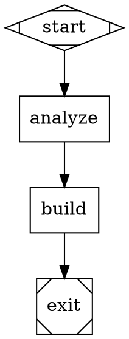

### Workflow with Approval

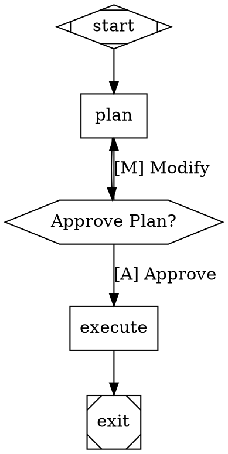

### Parallel Exploration

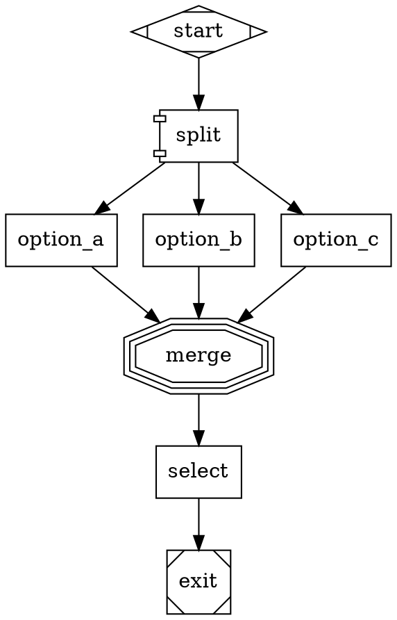

---

## 🎨 Node Shapes and Their Meanings

| Shape | Syntax | Meaning |
|-------|--------|---------|
| Diamond | `shape=Mdiamond` | Start/End point |
| Square | `shape=box` | Standard action/phase |
| Hexagon | `shape=hexagon` | Approval gate (human-in-the-loop) |
| Triple Octagon | `shape=tripleoctagon` | Merge/Fan-in point |
| Diamond | `shape=diamond` | Conditional branch |
| Circle | `shape=circle` | Checkpoint/Validation |
| Double Circle | `shape=doublecircle` | Goal gate (must succeed) |

---

## 🔀 Edge Routing and Labels

### Conditional Edges

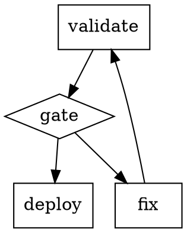

### Labeled Edges (User Choices)

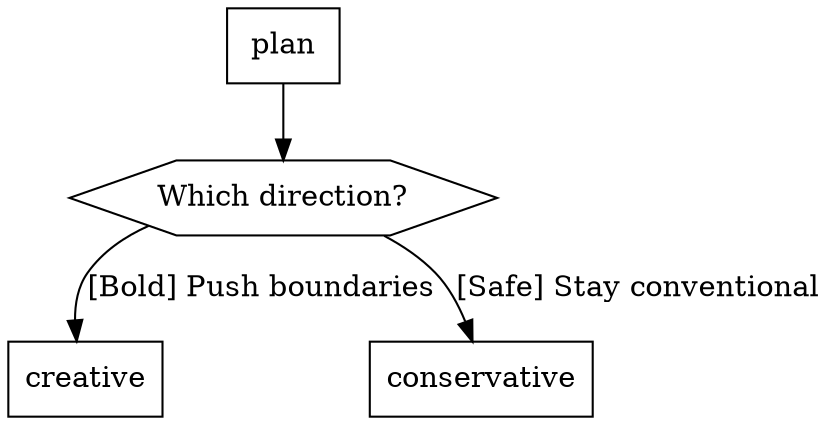

---

## 🎯 Real UI Generation Workflows

### Full Anti-Trend Workflow

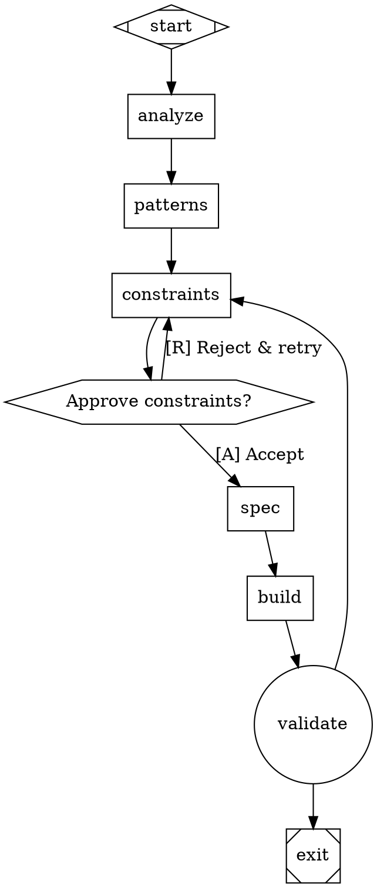

### Step Mode Workflow

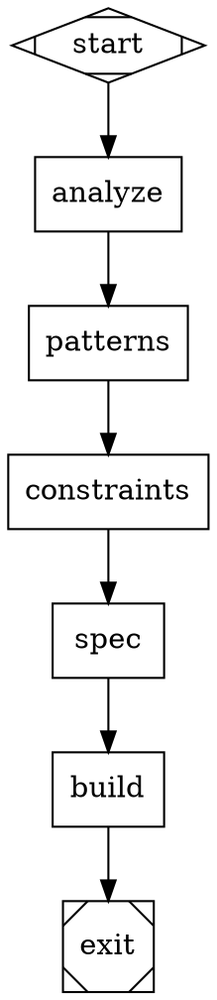

### Teams Mode Workflow

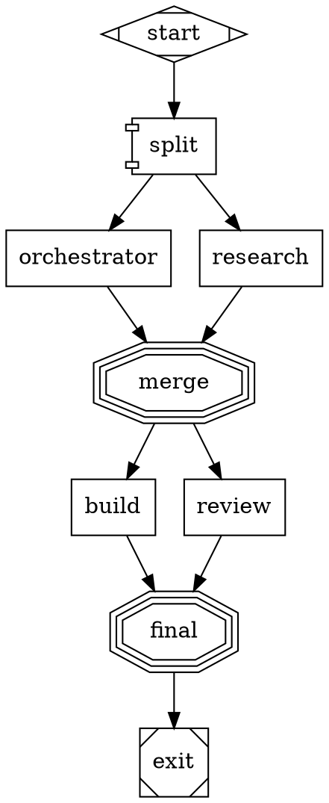

---

## 💾 Checkpoint Configuration

### Enable Checkpoints

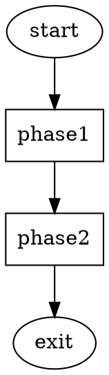

### Checkpoint Schema

```json
{
  "version": "1.0.0",
  "timestamp": "2025-02-10T14:30:45.123Z",
  "session_id": "uuid-v4",
  "current_node": "build",
  "completed_nodes": ["analyze", "patterns", "constraints", "spec"],
  "context_values": {
    "user_prompt": "...",
    "detected_keywords": ["modern"],
    "selected_constraints": ["paper_ink"]
  },
  "node_states": {
    "analyze": {
      "status": "completed",
      "duration_ms": 4234,
      "output_files": [".claude/.strike/analysis.md"]
    },
    "build": {
      "status": "in_progress",
      "started_at": "2025-02-10T14:30:50.000Z"
    }
  }
}
```

---

## 📊 Event System

### Event Types

```javascript
// Session lifecycle
SESSION_START
SESSION_END

// Phase execution
PHASE_START
PHASE_END
PHASE_ERROR

// UI-specific events
ANALYSIS_START
ANALYSIS_END
ANTI_PATTERNS_DETECTED
CONSTRAINTS_SELECTED
SPEC_CREATED
BUILD_START
BUILD_END
ACCESSIBILITY_CHECK
QUALITY_CHECK

// Checkpoint events
CHECKPOINT_SAVED
CHECKPOINT_LOADED
CHECKPOINT_FAILED

// User interaction
USER_APPROVAL_REQUESTED
USER_APPROVAL_GRANTED
USER_APPROVAL_DENIED
USER_ADJUSTMENT
```

### Event Schema

```json
{
  "kind": "CONSTRAINTS_SELECTED",
  "timestamp": "2025-02-10T14:30:45.123Z",
  "session_id": "uuid-v4",
  "data": {
    "constraints": [
      {"name": "paper_and_ink", "score": 35},
      {"name": "architectural", "score": 78}
    ],
    "rationale": "Selected to counter dark mode defaults"
  }
}
```

---

## 🎨 Model Stylesheet

Optimize LLM usage with CSS-like configuration:

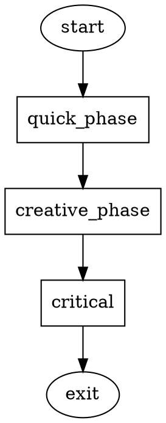

### Selector Specificity

- `*` - Universal (all nodes) - specificity 0
- `.classname` - Class selector - specificity 1
- `#nodeid` - ID selector - specificity 2

Higher specificity overrides lower.

---

## 🔧 Advanced Features

### Goal Gates

Nodes that MUST succeed before exit:

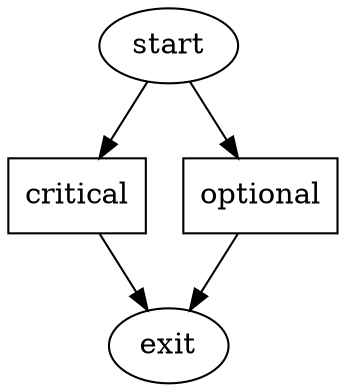

### Steering

Mid-task redirection:

```javascript
// In workflow execution
if (user_feedback === "too_conservative") {
  steer(current_node, "explore_creative");
}
```

### Context Fidelity

How conversation history is managed:

```dot
digraph ContextModes {
  graph [
    context_fidelity="full"  // full | condensed | minimal
  ]

  # full: All history included
  # condensed: Key points only
  # minimal: Current task only
}
```

---

## 📖 DOT Grammar Reference

### Graph Attributes

```dot
digraph GraphName {
  // Graph-level settings
  graph [
    goal="Workflow purpose"
    checkpoint=true
    events=true
    checkpoint_dir="/path/to/checkpoints"
    auto_resume=true
    max_parallel_branches=4
    context_fidelity="full"
    model_stylesheet="..."
  ]
}
```

### Node Attributes

```dot
node_name [shape=box,
  prompt="What this node does",
  checkpoint=true,
  goal_gate=true,
  wait_for_user=true,
  class="classname",
  id="unique_id",
  agent="agent_name",
  condition="expression",
  timeout_ms=30000
]
```

### Edge Attributes

```dot
from -> to [
  label="[A] Approve",
  condition="outcome=success",
  weight=1.0
]
```

---

## 🚀 Best Practices

1. **Keep workflows simple** - Complex DOT is hard to debug
2. **Use checkpoints** - Enable on long-running workflows
3. **Label user choices** - Clear labels like "[A] Approve"
4. **Set goal gates** - Mark critical success points
5. **Monitor events** - Track progress in real-time
6. **Optimize costs** - Use stylesheets for smart LLM selection
7. **Test workflows** - Validate DOT syntax before production
8. **Document decisions** - Explain why certain patterns were chosen

---

## 🔗 References

- **Full Attractor docs:** `plugins/ui/data/attractor/ATTRACTOR-INTEGRATION.md`
- **DOT grammar:** `plugins/ui/data/attractor/dot-grammar.md`
- **Event types:** `plugins/ui/data/attractor/event-types.json`
- **Checkpoint schema:** `plugins/ui/data/attractor/checkpoint-schema.json`

---

*Attractor Workflows Guide - DOT orchestration for UI generation*
