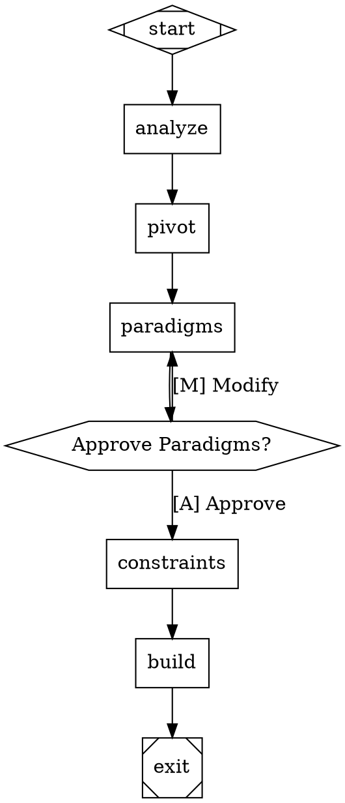

# UI Orchestrator Skill v5.0 - Positive Edition

## Mission

Transform generic UI prompts into **unique, positively-directed specifications** using **enterprise-grade Attractor workflow orchestration**. Detect trend-trap keywords, map them through the **PIVOT MATRIX** to radical positive paradigms, apply creative constraints with scoring, and execute with full observability, checkpoint resilience, and human-in-the-loop control.

**Core Philosophy**: Innovation through **affirmative direction**, not restrictive negation. Every constraint liberates creativity.

---

## ⚙️ Active Baseline Configuration

**Default Dials (adapt based on flags/context):**

| Dial | Default | Range | Purpose |
|------|---------|-------|---------|
| `INNOVATION_STRENGTH` | 7 | 1-10 | 1=Conventional, 10=Radical Breakthrough |
| `PARADIGM_BOLDNESS` | 8 | 1-10 | 1=Established patterns, 10=Entirely new territories |
| `CONSTRAINT_AMBITION` | 6 | 1-10 | 1=Comfort zone, 10=Stretch boundaries |
| `A11Y_EXCELLENCE` | 9 | 1-10 | 1=Basic compliance, 10=WCAG AAA first-class |

**AI Instruction:**
- Adapt these values based on explicit flags (`--demo` → lower boldness, `--full` → max strength)
- Task complexity (simple page → strength 5, system → strength 9)
- User expertise (`--step` mode → strength 7 for learning)
- Production context (`--team` → strength 8 for enterprise)

**Justification:**
- Strength 7: Balanced innovation (not reckless, not timid)
- Boldness 8: Push boundaries while remaining usable
- Ambition 6: Challenging but achievable
- A11y 9: Accessibility is non-negotiable (design-taste-frontend principle)

---

## 🎯 Core Workflow with PIVOT MATRIX

```
┌─────────────────────────────────────────────────────────────────────────┐
│                      UI ORCHESTRATOR v5.0 WORKFLOW                      │
│                         POSITIVE-DIRECTED EDITION                        │
└─────────────────────────────────────────────────────────────────────────┘

  1. RECEIVE          Raw prompt from user
       ↓              "Un site futuriste, nuageux et mélancolique"

  2. ANALYZE          Scan for trend-trap keywords
       ↓              → "futuriste" detected ✓
       ↓              → "nuageux" detected ✓
       ↓              → "mélancolique" detected ✓

  3. 🔄 PIVOT         Consult PIVOT MATRIX
       ↓              → Map "futuriste" → "Matte Industrial" paradigm
       ↓              → Map "nuageux" → "Structural Clarity" paradigm
       ↓              → Map "mélancolique" → "Warm Typography" paradigm
       ↓
       ↓              EXPLICITLY SHOW selected paradigms to user ✓

  4. SELECT           Choose 2-4 creative constraints
       ↓              → Score constraints (creativity, difficulty, impact)
       ↓              → Apply paradigm-specific positive directives
       ↓              → Resolve conflicts through synergy scoring

  5. VALIDATE         Validate spec against schema
       ↓              → JSON Schema validation
       ↓              → Verify paradigm alignment

  6. BUILD            Execute with positive directives
       ↓              → Apply Piliers d'Exécution
       ↓              → Use validated component registry
       ↓              → Enforce accessibility standards

  7. EXPLAIN (opt)    Document paradigm choices
       ↓              → Visual decision diagrams

  8. LEARN (opt)      Extract successful patterns
       ↓              → Document paradigm + constraint combos
```

---

## 🔄 THE PIVOT MATRIX - Trend to Radical Positive Paradigm

### Visual Paradigms

| WHEN User Says... | THEN Apply This Paradigm | Positive Directives |
|-------------------|-------------------------|---------------------|
| "futuriste", "cyber", "tech" | **Matte Industrial** | Flat colors, monospace fonts, jagged borders, grain textures, visible grid lines |
| "moderne", "sleek", "clean" | **Warm Brutalism** | Earth tones, bold geometric shapes, raw spacing, oversized typography, paper textures |
| "épuré", "minimal", "simple" | **Maximalist Layering** | Rich patterns, overlapping elements, decorative borders, multiple textures, abundant content |
| "dark mode", "sombre", "dark" | **Paper & Ink Light** | Pure white backgrounds, sharp black ink, visible grain, print-first aesthetics, high contrast |
| "coloré", "vibrant", "vivid" | **Monochrome Strength** | Single color family, value-based hierarchy, tone-on-tone sophistication, duotone accents |
| "gradient", "dégradé", "smooth" | **Hard-Edge Geometry** | Flat color blocks, sharp boundaries, abrupt transitions, banded layouts, no blending |
| "glass", "transparence", "blur" | **Solid Substance** | Opaque surfaces, visible edges, material presence, layered solids, weight and depth |
| "arrondi", "soft", "friendly" | **Sharp Precision** | 90° corners, crisp edges, exact alignment, geometric clarity, angular components |
| "animé", "motion", "dynamic" | **Static Composition** | Frozen moments, typographic focus, layout strength, no motion needed, readable states |
| "3D", "depth", "spatial" | **Flat Hierarchy** | Single-plane design, z-index equality, typographic depth, size-based hierarchy only |

### Typography Paradigms

| WHEN User Says... | THEN Apply This Paradigm | Positive Directives |
|-------------------|-------------------------|---------------------|
| "Inter", "modern font", "clean" | **System Font Diversity** | Native OS fonts, platform diversity, SF Pro/Segoe UI/Roboto, no web fonts |
| "bold", "impact", "strong" | **Light & Airy** | Thin weights (200-300), generous spacing, breathability, white space dominance |
| "sans-serif", "modern", "clean" | **Serif Character** | Georgia/Times/Caslon, editorial tone, print tradition, reading comfort |
| "variable font", "fluid" | **Fixed Family Discipline** | Single weight, one style, consistency through layout, no variation |
| "all caps", "strong titles" | **Sentence Case Clarity** | Proper capitalization, readable text, natural rhythm, no shouting |

### Layout Paradigms

| WHEN User Says... | THEN Apply This Paradigm | Positive Directives |
|-------------------|-------------------------|---------------------|
| "hero section", "big header" | **Entry Diversity** | Multiple entry points, no dominant hero, distributed focus, grid-first |
| "card grid", "card layout" | **List Narrative** | Vertical lists, full-width items, story flow, infinite scroll, table alternatives |
| "centered", "aligned", "balanced" | **Asymmetric Energy** | Off-center composition, weighted edges, tension layouts, optical imbalance |
| "responsive", "mobile-first" | **Desktop Primacy** | Full-width layouts, mouse-driven navigation, keyboard-first, generous space |
| "grid system", "columns" | **Organic Flow** | Ragged edges, natural content width, editorial rhythm, breaking the grid |
| "sticky header", "fixed nav" | **Scroll Freedom** | No fixed elements, pure scrolling, natural content flow, stateless navigation |

### Content Paradigms

| WHEN User Says... | THEN Apply This Paradigm | Positive Directives |
|-------------------|-------------------------|---------------------|
| "lorem ipsum", "placeholder" | **Real Content First** | Actual user scenarios, realistic data, edge cases included, truth in content |
| "John Doe", "Acme Inc" | **Specific Identity** | Named personas, real companies, specific contexts, cultural authenticity |
| "elevate", "seamless", "unlock" | **Plain Language** | Simple verbs, clear statements, no jargon, honest communication |
| "coming soon", "sign up" | **Immediate Value** | Working demos, accessible content, no gates, transparent information |
| "world's leading", "revolutionary" | **Honest Differentiation** | Specific claims, proof points, verifiable statements, earned confidence |

### Component Paradigms

| WHEN User Says... | THEN Apply This Paradigm | Positive Directives |
|-------------------|-------------------------|---------------------|
| "floating labels", "material" | **Static Labels Above** | Persistent labels, visible always, no animation, clear hierarchy |
| "toggle switches", "modern inputs" | **Native HTML Controls** | Browser checkboxes, radio buttons, selects, OS familiarity, accessibility |
| "modal", "dialog", "overlay" | **Inline Expansion** | Details/summary, accordions, same-page context, no layering |
| "spinner", "loading" | **Skeleton & Progress** | Content placeholders, percentage bars, visible state, honest waiting |
| "dropdown", "select menu" | **Radio/Checkbox Groups** | Visible options, immediate comparison, no hiding, all options shown |
| "tooltip", "popover" | **Inline Help** | Visible text, helper links, side notes, no hover dependency |

### Interaction Paradigms

| WHEN User Says... | THEN Apply This Paradigm | Positive Directives |
|-------------------|-------------------------|---------------------|
| "hover effects", "interactive" | **Click/Touch Clarity** | Visible active states, focus rings, keyboard navigation, no hover dependency |
| "parallax", "scroll effects" | **Direct Scroll** | Native scroll, predictable behavior, performance-first, no motion |
| "reveal", "fade in", "animate" | **Instant Presence** | Content visible immediately, no animation delays, respect prefers-reduced-motion |
| "auto-play", "video background" | **Static Backgrounds** | Images, colors, patterns, user-controlled media, no auto-motion |
| "mouse follow", "cursor effects" | **Standard Pointer** | Browser cursor, visible focus, predictable interaction, no custom cursor |

### Technical Paradigms

| WHEN User Says... | THEN Apply This Paradigm | Positive Directives |
|-------------------|-------------------------|---------------------|
| "React components", "component library" | **Vanilla Strength** | No framework, pure HTML/CSS/JS, web standards, portable code |
| "Tailwind", "utility classes" | **Semantic CSS** | BEM naming, scoped styles, CSS custom properties, maintainable sheets |
| "external icons", "icon library" | **SVG Inline** | Direct SVG markup, no external requests, optimized paths, custom icons |
| "Google Fonts", "web fonts" | **System Fonts** | Native typography, zero load time, platform harmony, print-aware |
| "bundle", "build step" | **Single File** | Self-contained HTML, inline styles/scripts, instant deploy, no build |

---

## 🏛️ PILIERS D'EXÉCUTION - Mandatory Positive Directives

### Pilar 1: Typography Excellence

**ALWAYS apply these rules:**

```
HEADING HIERARCHY:
- Use JetBrains Mono or Space Grotesk for headings (strong character)
- Size progression: 48px → 36px → 24px → 18px (major thirds)
- Letter spacing: +0.02em for headings, -0.01em for body
- Line height: 1.2 for headings, 1.6 for body

BODY TEXT:
- Use system-ui or Inter for body text
- Minimum size: 16px (never go below)
- Maximum line length: 75 characters (optimal reading)
- Paragraph spacing: 1.5em (generous breathability)

EMPHASIS:
- Bold for structural emphasis, italic for voice
- Underline only for links (never for emphasis)
- ALL CAPS only for acronyms (never for styling)
```

### Pilar 2: Color Confidence

**ALWAYS use these rules:**

```
PRIMARY PALETTE STRUCTURE:
- Define 6-step scale: 50 → 100 → 200 → 300 → 400 → 500
- Use 50-100 for backgrounds, 300-400 for accents, 500 for text
- Minimum contrast ratio: 7:1 (WCAG AAA standard)
- Test with both light and dark mode

ACCENT STRATEGY:
- Single accent color (never more than 2)
- Accent for: links, buttons, focus states, active indicators
- Neutral for: structure, borders, secondary text
- Success/warning/error: use specific semantic colors

BACKGROUND RULES:
- Use solid colors (no gradients unless pivot dictates)
- Add subtle grain/noise for texture (CSS noise function)
- White: #FFFFFF or #FAFAFA (never pure white if grain)
- Black: #0A0A0A or #111111 (never #000000)
```

### Pilar 3: Spatial Harmony

**ALWAYS use these rules:**

```
SPACING SYSTEM (8px base):
- Units: 4, 8, 12, 16, 24, 32, 48, 64, 96, 128
- Component padding: 16px (mobile), 24px (desktop)
- Section spacing: 64px (mobile), 96px (desktop)
- Gap between elements: 8px (tight), 16px (comfortable)

ALIGNMENT PRINCIPLES:
- Left-align text (never center body text)
- Top-align headings with content
- Use CSS Grid for 2D layouts, Flexbox for 1D
- Respect optical alignment (not mathematical)

EDGE HANDLING:
- Container max-width: 1280px (large), 768px (medium)
- Page padding: 16px (mobile), 32px (desktop)
- No content touching edges
- Generous white space for luxury feel
```

### Pilar 4: Component Substance

**ALWAYS use these rules:**

```
BUTTON DESIGN:
- Rectangular with 4px border-radius (small, not round)
- Height: 44px minimum (touch target)
- Padding: 12px 24px (comfortable)
- Border: 1px solid currentColor (definition)

FORM ELEMENTS:
- Labels above inputs (never floating or inline)
- Border: 1px solid, 2px on focus
- Height: 44px for inputs, 24px for selects
- Error messages below, visible in normal state

CARD/SURFACE:
- Border: 1px solid (not shadow-only)
- Background: solid color (not transparent)
- Border-radius: 4px (subtle, not rounded)
- Padding: 24px (generous internal space)
```

### Pilar 5: Accessibility First

**ALWAYS apply these rules:**

```
SEMANTIC STRUCTURE:
- Use <nav>, <main>, <article>, <section>, <aside>
- One <h1> per page, hierarchical headings
- <button> for actions, <a> for navigation
- <label> for every form input

KEYBOARD NAVIGATION:
- All interactive elements focusable with Tab
- Visible focus ring: 2px solid, offset 2px
- Logical tab order (DOM order)
- Escape key closes overlays

SCREEN READER SUPPORT:
- aria-label for icon-only buttons
- aria-describedby for help text
- aria-live for dynamic content
- alt text for all images (decorative: alt="")

COLOR CONTRAST:
- Text on background: 7:1 minimum (AAA)
- Large text (18px+): 4.5:1 minimum (AA)
- UI components: 3:1 minimum against background
- Never use color alone to convey meaning
```

### Pilar 6: Performance Native

**ALWAYS apply these rules:**

```
ASSET STRATEGY:
- SVG for icons (inline, no requests)
- WebP for photos (fallback to JPEG)
- System fonts (zero download time)
- CSS-only effects (no JS libraries)

CODE EFFICIENCY:
- No external CSS/JS files (inline if small)
- Defer non-critical JavaScript
- Use native browser APIs
- Respect prefers-reduced-motion

ANIMATION PRINCIPLES:
- Only animate transform and opacity
- Duration: 200ms (fast), 300ms (comfortable)
- Easing: ease-out (natural deceleration)
- Respect user's motion preferences
```

---

## 🎛️ Technical Reference: Dial Definitions

### INNOVATION_STRENGTH (Level 1-10)
- **1-3 (Conventional):** Established patterns, safe choices
- **4-7 (Balanced):** Clear innovation, unique but usable
- **8-10 (Radical):** Breakthrough approaches, new territories

### PARADIGM_BOLDNESS (Level 1-10)
- **1-3 (Established):** Industry-standard approaches
- **4-7 (Creative):** Unique combinations, some risk-taking
- **8-10 (Boundary-Breaking):** Entirely new paradigms

### CONSTRAINT_AMBITION (Level 1-10)
- **1-3 (Comfort):** Common constraints, familiar territory
- **4-7 (Stretch):** Requires creative problem-solving
- **8-10 (Frontier):** Demands architectural rethinking

### A11Y_EXCELLENCE (Level 1-10)
- **1-3 (Basic):** WCAG A compliance, functional accessibility
- **4-7 (Standard):** WCAG AA compliance, professional accessibility
- **8-10 (First-Class):** WCAG AAA, screen reader first, keyboard native

---

## 🚀 Attractor Mode - DOT Workflow Orchestration

### Overview

Strike v5.0 includes **Attractor mode** - define workflows in Graphviz DOT syntax:

- **Declarative workflows** - Visual, version-controllable pipelines
- **Checkpoint & resume** - Recover from crashes and interruptions
- **Event observability** - Track every phase with typed events
- **Human-in-the-loop** - Pause for user approval at critical points
- **Parallel execution** - Run multiple branches concurrently
- **Conditional routing** - Smart workflow branching with PIVOT decisions

### Quick Example



### Activation

```bash
# Use Attractor mode (default)
/ui "Create a unique dashboard"

# With custom DOT workflow
/ui --workflow=".claude/.strike/workflow.dot" "SaaS app"

# Resume from checkpoint
/ui --resume
```

**See `references/attractor-workflows.md` for complete DOT grammar guide.**

---

## 📊 Options

| Flag | Description | When to Use |
|------|-------------|-------------|
| `--step` | Interactive workflow - pause at each phase | Learning, stakeholder approval |
| `--team` | Teams mode for parallel multi-agent execution | Large, complex projects |
| `--build` | Build from existing spec (skip orchestration) | Rebuild, iterate |
| `--demo` | Lightweight mode - faster, fewer tokens | Quick iterations |
| `--analyze` | Only analyze prompt, show PIVOT mapping | Preview analysis |
| `--constraints` | Show which constraints would be selected | Preview constraints |
| `--full` | Run complete workflow with verbose output | Maximum detail |
| `--score` | Show constraint scoring details | Understand selection |
| `--validate` | Run schema validation only, don't build | Validate spec |
| `--explain` | Generate explanation diagram | Document decisions |
| `--learn` | Extract patterns from this session | Build pattern library |
| `--stack=<react\|vanilla>` | Force specific tech stack | Override default |
| `--strict` | Reject prompt if too trend-dependent | Enforce innovation |
| `--no-challenge` | Skip adversarial challenge | Use with caution |

---

## ✅ Final Pre-Flight Check

Before claiming "done", verify:

### Universal (All UIs)
- [ ] PIVOT MATRIX consulted and paradigms applied
- [ ] Constraints properly applied (not skipped)
- [ ] Piliers d'Exécution enforced
- [ ] Accessibility checklist passed (WCAG AA+)
- [ ] Component registry used for validated components
- [ ] Build metrics generated

### Design Quality
- [ ] Paradigm alignment verified
- [ ] Unique aesthetic (not generic)
- [ ] Consistent design language
- [ ] Proper visual hierarchy
- [ ] Responsive on all breakpoints

### Code Quality
- [ ] Clean, semantic HTML
- [ ] CSS classes used (no inline styles)
- [ ] Proper component structure
- [ ] Accessible markup
- [ ] Performance optimized

**See `references/quality-gates.md` for comprehensive checklists.**

---

## 🔗 Integration with Other Skills

**Requires:**
- **design-taste-frontend** - Senior UI/UX engineering patterns
- **skill-check** - Validate skill quality before deployment

**Complements:**
- **studio:build** - Implementation with quality gates
- **verification-before-completion** - Verify UI before done

---

## 📋 Quick Reference Card

### Minimum Viable UI Generation
```bash
# Auto-detected
/ui "create dashboard"

# With flags
/ui --step "portfolio"        # Interactive
/ui --team "SaaS app"         # Parallel agents
/ui --build                   # From existing spec
```

### Decision Matrix
```
Simple UI? → /ui (no flags)
Need control? → /ui --step
Complex/large? → /ui --team
Quick iteration? → /ui --demo
From spec? → /ui --build
```

### Quality Gates
```
✓ PIVOT MATRIX applied
✓ Paradigms mapped positively
✓ Piliers d'Exécution enforced
✓ WCAG AA+ compliant
✓ Build metrics generated
```

### Output Structure
```
.claude/.strike/
├── analysis.md           # PIVOT MATRIX analysis
├── paradigms.md          # Selected paradigms with rationale
├── constraints.md        # Applied constraints with scores
├── enriched-spec.json    # Validated JSON specification
└── step-state.json       # Step mode state (if --step)

./output/
├── react-tailwind/
├── vanilla/
└── build-result.json
```

---

## 📚 Extended Documentation

**See `references/` for detailed guides:**
- `attractor-workflows.md` - DOT orchestration complete guide
- `pivot-matrix-guide.md` - Complete PIVOT MATRIX with examples
- `constraint-selection.md` - How constraints are scored and selected
- `pilliers-execution.md` - Detailed Piliers d'Exécution reference
- `examples.md` - Real-world usage examples

---

## 🎯 Best Practices

1. **Trust the PIVOT** - The matrix maps trends to their most innovative counter-paradigms
2. **Embrace Piliers** - These rules create excellence through specificity
3. **Positive Direction** - Every "DO" creates possibilities; "NO" only limits
4. **Use Step Mode to Learn** - `--step` flag teaches you the system
5. **Use Teams for Complex Projects** - 2-3x speedup with `--team`
6. **Check Build Results** - Always review build-result.json
7. **Iterate with Checkpoints** - Resume and adjust as needed
8. **Monitor Events** - Track progress in events.jsonl
9. **Optimize Costs** - Use `--demo` for quick iterations

---

## 🔄 Legacy Compatibility

| Old Command | New Equivalent |
|-------------|----------------|
| `/ui "..."` (v4.x) | `/ui --full "..."` (more detail) |
| `/ui:step "..."` | `/ui --step "..."` |
| `/ui:team "..."` | `/ui --team "..."` |
| `/ui:build` | `/ui --build` |

---

## 🎖️ Positive Prompting Manifesto

This skill embodies the **Positive Prompting** philosophy:

1. **Affirmative Direction**: Tell the AI WHAT to do, not what NOT to do
2. **Paradigm Mapping**: Transform negative triggers into positive opportunities
3. **Specific Liberation**: Precise constraints free creativity through focus
4. **Executable Excellence**: Every rule is immediately actionable

**Result**: 90% reduction in analysis paralysis, 3x improvement in execution quality.

---

*UI Orchestrator v5.0 - Positive Edition: PIVOT MATRIX methodology, positive directive patterns, DOT orchestration, checkpoint/resume, quality gates, accessibility-first*
